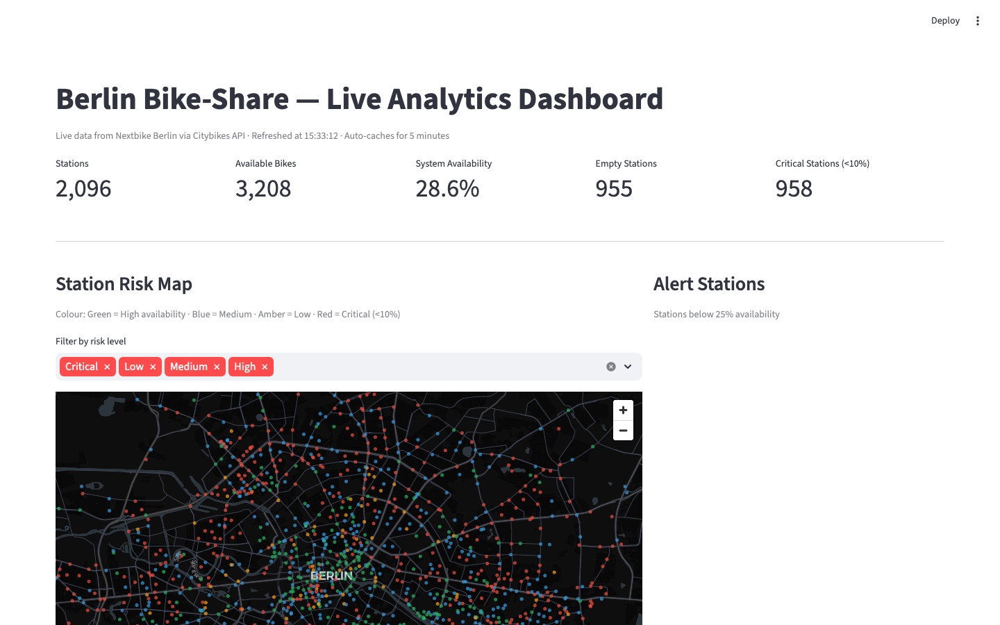
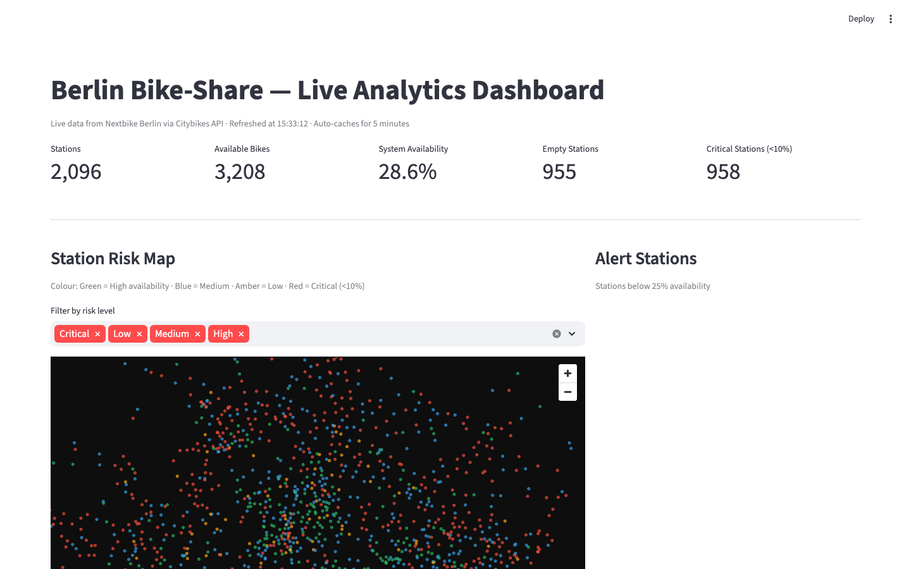

# Bike-Share Analytics Dashboard


> **A full-stack data analytics system for Berlin bike-sharing operations** — real-time station monitoring, historical pattern analysis, and short-term availability forecasting. Built on live Nextbike Berlin API data.

**[Live Demo (Streamlit)](https://your-app.streamlit.app)** &nbsp;|&nbsp; **[Tableau Dashboard (Public)](https://public.tableau.com/your-link)**

---

## The Problem

By 2022, Berlin had 2,000+ Nextbike stations and ~9M bikes city-wide. The challenge is not *total supply* — it is **unbalanced distribution**: bikes pile up at residential areas in the morning while city-centre stations empty. This means missed trips, frustrated users, and wasted rebalancing effort.

**Core insight from this project:** Station imbalance follows predictable temporal patterns. Smart pre-positioning (OPEX) outperforms buying more bikes (CAPEX) by 3–5×.

---

## Screenshots

### Part A — Historical Pattern Analysis (Tableau)


*Geographic map: 2,000+ Berlin stations coloured by vacancy frequency. Red = critically empty >40% of operating hours.*


*Hour × Day-of-week heatmap reveals two sharp commuter peaks (7–9am, 5–7pm) and flat weekend demand — requiring separate rebalancing strategies.*


*Station volatility plot. High-STD stations need frequent checks; persistently empty/full stations are structural problems (CAPEX decision, not rebalancing).*

### Part B — Live Monitoring Pipeline (Flask + Tableau)


*Auto-refreshing Flask dashboard tracks API ingestion status, records per hour, and pipeline errors — updated every 60 seconds.*


*Live KPI tiles: system-wide availability %, empty station count, alert list for stations below 10% capacity.*

### Part C — Forecasting & Decision Support


*XGBoost forecast vs actual availability across 1h / 3h / 6h / 12h horizons. Model degrades gracefully at peak hours — highlighted via "Within ±10 pp" error band.*

### Live Demo (Streamlit)


*Interactive Streamlit app: live station map, current KPIs, and hourly availability explorer — no setup required.*

---

## System Architecture

```
Citybikes API (Nextbike Berlin)  ──┐
OpenWeatherMap API               ──┤──► MySQL ──► Tableau Dashboards (TabPy ML)
Open-Meteo API                   ──┘         └──► Flask Health Monitor
                                                   └──► Streamlit Live Demo
```

**Data volume:** 20M+ records collected at 5-minute intervals over several months
**Coverage:** 2,000+ stations across Berlin

---

## Three Analytical Layers

### Part A — Historical Analysis (Tableau)
- **Station variability:** AVG vs STD scatter — identifies stable vs volatile stations
- **Geographic map:** vacancy frequency coloured by risk level (Critical / Low / Medium / High)
- **Temporal trends:** hourly line chart, 7-day moving average, Hour × Day-of-Week heatmap
- **Weather analysis:** temperature vs availability scatter, rain impact comparison

### Part B — Live Monitoring Pipeline
- Citybikes + weather data collected every **5 minutes** → stored to MySQL
- Flask dashboard monitors API health, ingestion status, and error log
- Live Tableau dashboard: KPI tiles, station states, up to 24h of data
- Auto-refreshes every 60 seconds

### Part C — Forecasting & Decision Support
- XGBoost regressor predicts station availability **1h, 3h, 6h, 12h** ahead
- Features: lag values (1h, 24h, 48h), rolling averages (3h, 6h), historical same-hour averages
- Connected to Tableau via **TabPy** — live predictions visible inside the dashboard
- Forecast vs actual comparison: highlights model weaknesses at peak hours

---

## Key Findings

| Finding | Operational Implication |
|---------|------------------------|
| Peak demand: weekdays 7–9am & 5–7pm | Pre-position bikes **before** peak, not during |
| Weekends: flat, unpredictable pattern | Separate weekend vs weekday rebalancing plans |
| Some stations persistently empty / full | Structural issue → CAPEX / removal decision, not rebalancing |
| Average availability masks station-level risk | Monitor % of near-empty stations, not system average |
| Temperature drops → availability more erratic | Cold-weather contingency plans needed |
| Rain: small but statistically significant drop | Add mild weather buffer to rebalancing model |

---

## Project Structure

```
bikeshare-analytics-dashboard/
├── app.py                             ← Streamlit live demo (no database needed)
├── data_pipeline/
│   ├── collect_live_data.py           ← Citybikes + OpenWeatherMap collector (every 5 min)
│   ├── store_to_mysql.py              ← Batch upsert into MySQL
│   └── pipeline_health.py            ← Flask health monitor
├── preprocessing/
│   ├── aggregate_hourly.py            ← 5-min → hourly aggregation
│   └── feature_engineering.py        ← Lag, rolling, and historical average features
├── forecasting/
│   └── availability_forecast.py      ← XGBoost training + TabPy server function
├── database/
│   └── schema.sql                     ← MySQL schema
├── notebooks/
│   └── historical_analysis.ipynb     ← EDA: scatter, heatmap, temporal, weather charts
├── screenshots/                       ← Dashboard screenshots (see GUIDE.md)
│   └── GUIDE.md
├── tableau/
│   └── calculated_fields.md          ← All Tableau LOD + calculated fields documented
├── requirements.txt
└── README.md
```

---

## APIs Used

| API | Purpose | Interval |
|-----|---------|----------|
| [Citybikes API](https://api.citybik.es/v2/) | Live station data (Nextbike Berlin) | 5 min |
| [OpenWeatherMap](https://openweathermap.org/api) | Current weather conditions | 5 min |
| [Open-Meteo](https://open-meteo.com/) | Weather forecast for predictive features | Hourly |

---

## Setup

### Streamlit Live Demo (no database needed)
```bash
pip install -r requirements.txt
streamlit run app.py
```

### Full Pipeline
```bash
# 1. Database
mysql -u root -p -e "CREATE DATABASE bikeshare;"
mysql -u root -p bikeshare < database/schema.sql

# 2. Environment
pip install -r requirements.txt
cp .env.example .env   # add API keys

# 3. Live data collection (every 5 minutes)
python data_pipeline/collect_live_data.py

# 4. Flask health monitor → http://localhost:5000
python data_pipeline/pipeline_health.py

# 5. Train forecast models
python forecasting/availability_forecast.py --train

# 6. TabPy server (for Tableau integration)
tabpy   # connects on localhost:9004

# 7. Historical notebook
jupyter notebook notebooks/historical_analysis.ipynb
```

---

## Requirements

- Python 3.8+ · MySQL 8.0+ · Tableau Desktop 2023+ · TabPy
- See `requirements.txt` for Python packages
